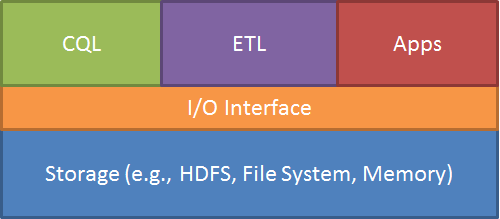

# DataMine

DataMine aims to provide a comprehensive solution to the challenges of information management and analytics at Turn. The diagram below illustrates the important components in DataMine.



Basically it is composed of three layers. 

* Storage layer is the fundation of DataMine, which defines a data schema language and provides the implementation of the data serialization / de-serialization on different data storage, such as HDFS or Memory-based File System.
   
* I/O Interface represents the data abstraction using a set of APIs, through which the application can get access to the data in the storage.

* Application layer is composed of an analytical query engine, ETL processes and other applications.


DataMine can help the user to build a data warehouse more effectively. All table schema are described in a full-featured schema language (i.e., DataMine IDL), based on which a code generation approach is applied automatically to generate a set of Java classes. The generated code include the implementation of APIs that define the way to access the data. Multiple data formats are supported in DataMine, where a table can be stored in row-based or column-oriented. Therefore, the features of DataMine can be summarized as: 

### Metadata Driven

In DataMine, a data store (i.e., *tableList*) has a set of tables. Each table (i.e., *table*) is composed of records. The table schema (or the record structure) can be described as a tuple, *(id, name, type, defaultValue, isRequired, ...)*.

Please refer to [DataMine IDL](doc/DataMine_IDL.md) for more detail.

#### Schema Evolution (Data Backward-Compatibility)

One common requirement from the DataMine user is to add new attributes to the existing table, e.g., Impression. This requires that the data access support backward compatibility, in other words, the change must allow reading data in the old format. DataMine supports the following changes on the table schema: 

<!-- TODO consider them again once the RecordBuffer-Parquet is possible! -->

* No new *REQUIRED* field can be added to any existing table; adding *OPTIONAL* field is OK.
* An *OPTIONAL* field cannot be changed to *REQUIRED*; it is OK to change a *REQUIRED* field to be *OPTIONAL*.
* The type of existing field cannot be changed.
* No existing field can be removed.


### API-based Infrastructure

DataMine defines a set of APIs for the data access. These APIs define a way how to read and write the data of a table, the format how the data of a table are stored in.  


### Code Generation

DataMine follows a code generation approach to create the code for data access. Particularly, it generates a set of Java classes based on the DataMine schema. 

* **Table Interface**: a Java interface is generated for each table defined in DataMine schema, where a setter and a getter functions defined for each attribute of the table. 

* **Table Implementation**: a Java class is generated for each table considering what file format (e.g,, row-based or column-based) is used and how a record is represented in memory (e.g., Thrift-generated class).

* **Table ser/deserialization Approach**: a set of Java classes are generated for the data serialization and deserialization, according to any specific *table implementation*.  

Thus it is much simpler to create new tables or add new attributes into the existing table. In most cases, no programming is involved to enable the data accessibility of new attributes, and the change would be effected automatically. 

### Multiple Storage Formats

In DataMine, a table can be serialized in different ways. It can be row based, or column based. 

## Code of Conduct

The following guides are suggested:

* [Code style guide](http://intranet.turn.com/display/ENG/Code+style+guide)
* [Turn Automation - Coding Guidelines](http://intranet.turn.com/display/OffshoreDocs/Turn+Automation+-+Coding+Guidelines)

## License

```
/**
 * Copyright (C) 2015 Turn Inc.
 *
 * Licensed under the Apache License, Version 2.0 (the "License");
 * you may not use this file except in compliance with the License.
 * You may obtain a copy of the License at
 *
 *    	http://www.apache.org/licenses/LICENSE-2.0
 *
 * Unless required by applicable law or agreed to in writing, software
 * distributed under the License is distributed on an "AS IS" BASIS,
 * WITHOUT WARRANTIES OR CONDITIONS OF ANY KIND, either express or implied.
 * See the License for the specific language governing permissions and
 * limitations under the License.
 */
```
 