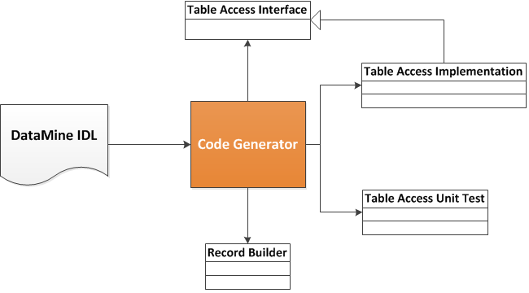
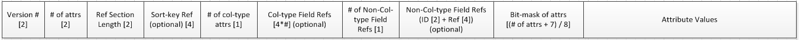

# Record Buffers

Record buffers are a flexible, efficient, automated mechanism for serializing structure data, especially for nested structure data. 
It uses an interface description language (IDL) to describe the schema of data and allows the user easily to read and write the data with special generated source code. 
Importantly record buffers support schema evolution, so it enables the deployed code for old format to work with the updated data structure.

## Why?

Record buffers is not the only one solution while dealing with the big data problem in our case. For example, [Thrift](https://thrift.apache.org/), [Avro](http://avro.apache.org/) and [Protocol Buffers](https://code.google.com/p/protobuf/) provide the very similar ideas. However, record buffers have some advantages considering the special problem at Turn. For instance, the nested structure is normal in our application; record buffer does optimize the data accessing performance especially there is nested structure in the data. 

## IDL Specification

Please see [DataMine IDL](https://stash.turn.com/projects/DM/repos/aup2/browse/doc/DataMine_IDL.md).

## Code Generation

Record buffers follow a code generation approach while building the representation layer for table access. Particularly a set of Java classes or interfaces are created automatically, including:

* *Table Access Interface*: a Java interface is generated for each table defined in table schema, where the setter and getter functions are declared for each attribute of the table. 
* *Table Access Implementation*: a Java class is generated for each table based on the file format (e.g,, row-based or column-based) and the representation in memory (e.g., POJO-class or Record Buffer).
* *Record Builder*: a class is generated for the instance creation given a table interface. 
* *Table Access Implementation Test*: a Java class is generated for each table defined in the table schema, to produce the data for possible unit tests. 

To enable such a code generation, the project POM should include the plugin below. 

	<build>
		<plugins>
			<plugin>
				<groupId>com.turn.datamine.mojo.storage</groupId>
				<artifactId>recordbuffers-maven-plugin</artifactId>
				<version>${datamine.version}</version>
				<executions>
					<execution>
						<id>ti</id>
						<goals>
							<goal>table_interfaces</goal>
						</goals>
						<phase>generate-sources</phase>
						<configuration>
							<schemaPath>/path/to/schema/file</schemaPath>
							<packageName>com.turn.datamine.storage.aup.interfaces</packageName>
						</configuration>
					</execution>
					<execution>
						<id>tic</id>
						<goals>
							<goal>table_interface_convertors</goal>
						</goals>
						<phase>generate-sources</phase>
						<configuration>
							<schemaPath>/path/to/schema/file</schemaPath>
							<packageName>com.turn.datamine.storage.aup.operator.conversion</packageName>
						</configuration>
					</execution>
					<execution>
						<id>rb</id>
						<goals>
							<goal>record_buffer_tables</goal>
						</goals>
						<phase>generate-sources</phase>
						<configuration>
							<schemaPath>/path/to/schema/file</schemaPath>
							<packageName>com.turn.datamine.storage.aup.recordbuffers</packageName>
						</configuration>
					</execution>
					<execution>
						<id>rb-test</id>
						<goals>
							<goal>record_buffer_table_tests</goal>
						</goals>
						<phase>generate-sources</phase>
						<configuration>
							<schemaPath>/path/to/schema/file</schemaPath>
							<packageName>com.turn.datamine.storage.aup</packageName>
						</configuration>
					</execution>
				</executions>
			</plugin>
		</plugins>
	</build>
		

Note that the two parameters can be configured:

- *schemaPath* : the path where the schema JSON file is stored, for example, *src/main/resources/AUPConf.json*; it may be the same for all goals.
- *packageName* : the package name of the output Java code, for example, *com.turn.datamine.storage.aup.interfaces*; each goal may have its own unique package name. 

## Encoding

Record buffers use an array of bytes to represent the content of a table record. It has 10 sections showing the figure below. 

They work together to ensure the correct serialization and de-serialization. One big difference from other encoding schemes (like Protocol Buffers), there is a reference section defined to speed up the data access. 

- *Version No.* specifies what version of schema this record uses; it is required and takes 2 bytes.
- *The number of attributes* in the table schema is required and takes 2 bytes.
- *Reference section length* is the number of bytes used for the referene section; it is required and takes 2 bytes. 
- *Sort-key reference* stores the offset of the sork key column if exists; it is optional and takes 4 bytes if exists. 
- *The number of collection-type attributes* uses 1 byte for the number of collections in the table, and it is required.
- *Collection-type field references* stores the offsets of the collections in the table sequentially; note that the offset of an empty collection is -1.
- *The number of non-collection-type field reference* uses 1 byte for the number of non-collection-type columns which have *hasRef* annotation.
- *Non-collection-type field references* sequentially store the ID and offset pair of columns with *hasRef* annotation if exist. 
- *Bit mask of attributes* is a series of bytes to indicate the availability of any attributes in the table. 
- *Attribute values* store the values of available attributes in sequence; note that the sequence should be the same as that defined in the schema. 

### Reference Section

One of the advantages by the record buffers is that it can minimize the data de-serialization. In other words, it eliminates the record deserialization while the access occurs to the attributes having the offset references in the reference section.

Currently, there are three types of attributes having their offsets in the reference section. 

1. The attribute as the table sort-key: it speeds up the record sorting;
2. The attribute having the annotation of "hasRef": the attribute can be specified by the user if it is frequently accessed.
3. The attribute of collection type (i.e., nested table): by default, any nested table has its offset stored in the referene section; according to our experience the nested table is often the hot spot. Having its offset in the reference section, it could significantly speed up some basic operations, like getting the size of the nested table. 
 

## Examples
